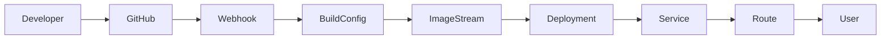
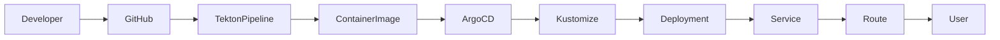

Abaixo está um **README.md completo**, pronto para colocar na raiz do seu repositório.
Ele inclui:

* explicação da demo
* arquitetura
* comparação OpenShift 4.12 vs 4.20
* diagramas (Mermaid)
* passo a passo completo
* comandos para comprovar a remoção da API
* fluxo de CI/CD moderno

Você pode copiar **diretamente como `README.md`**.

---

# Kubernetes / OpenShift Compatibility Demo

This repository demonstrates a **real-world compatibility scenario** when migrating Kubernetes workloads between platform versions.

It shows how an application and its manifests behave differently between:

* **OpenShift 4.12 (Kubernetes 1.25)**
* **OpenShift 4.20 (Kubernetes 1.30)**

The purpose of this demo is to illustrate:

* how **deprecated Kubernetes APIs eventually disappear**
* why **applications must evolve with the platform**
* how **modern deployment practices (Pipelines + GitOps)** solve these problems

---

# Demo Overview

This demo deploys a simple Python HTTP application using two approaches:

| Environment    | Deployment style           |
| -------------- | -------------------------- |
| OpenShift 4.12 | Legacy / manual deployment |
| OpenShift 4.20 | Modern CI/CD with GitOps   |

The key incompatibility demonstrated is the removal of the Kubernetes API:

```
flowcontrol.apiserver.k8s.io/v1beta2
```

---

# Architecture Overview

## Legacy Deployment (OpenShift 4.12)



Characteristics:

* manual deployment
* BuildConfig based CI
* ImageStream triggers
* deprecated Kubernetes APIs still accepted

---

## Modern Deployment (OpenShift 4.20)



Characteristics:

* GitOps driven deployment
* declarative infrastructure
* CI/CD automation
* compatible with modern Kubernetes APIs

---

# Repository Structure

```
.
├── app/
│   ├── Dockerfile
│   └── server.py
│
├── manifests/
│   ├── namespace.yaml
│   ├── deployment.yaml
│   ├── service.yaml
│   ├── route.yaml
│   └── flowschema-v1beta2.yaml
│
├── pipeline/
│   └── pipeline.yaml
│
├── gitops/
│   ├── base/
│   │   ├── deployment.yaml
│   │   ├── service.yaml
│   │   └── route.yaml
│   │
│   └── overlays/
│       └── ocp420/
│           ├── kustomization.yaml
│           └── application.yaml
│
└── README.md
```

---

# Application

The demo application is a simple Python HTTP server exposing diagnostics endpoints.

Example response:

```
OK - compat demo running
```

Additional endpoints allow testing:

* DNS resolution
* TCP connectivity
* health checks

---

# Prerequisites

You need access to:

* **OpenShift 4.12**
* **OpenShift 4.20**
* `oc` CLI
* OpenShift Pipelines
* OpenShift GitOps

---

# Part 1 — Legacy Deployment on OpenShift 4.12

This scenario reproduces how many workloads are deployed in older clusters.

---

## Create project

```
oc new-project compat-demo
```

---

## Deploy manifests

```
oc apply -f manifests/
```

Resources created:

```
Deployment
Service
Route
FlowSchema
```

---

## Verify deployment

```
oc get all
```

---

## Access the application

```
curl http://<ROUTE>
```

Expected output:

```
OK - compat demo running
```

---

## Verify FlowSchema

```
oc get flowschema
```

Example:

```
compat-demo-v1beta2-flowschema
```

This resource uses the API:

```
flowcontrol.apiserver.k8s.io/v1beta2
```

---

# Part 2 — Deploying the same manifests on OpenShift 4.20

Now we attempt to deploy **exactly the same manifests**.

---

## Create project

```
oc new-project compat-demo
```

---

## Apply manifests

```
oc apply -f manifests/
```

Expected error:

```
error: resource mapping not found for name: "compat-demo-v1beta2-flowschema"
no matches for kind "FlowSchema" in version "flowcontrol.apiserver.k8s.io/v1beta2"
```

---

# Root Cause

The Flow Control API evolved across Kubernetes versions.

The version used in the manifests:

```
flowcontrol.apiserver.k8s.io/v1beta2
```

was **removed**.

---

# Verifying API Removal

## On OpenShift 4.12

```
oc api-resources | grep FlowSchema
```

Output:

```
flowschemas   flowcontrol.apiserver.k8s.io/v1beta2
```

---

## On OpenShift 4.20

```
oc api-resources | grep FlowSchema
```

Output:

```
flowschemas   flowcontrol.apiserver.k8s.io/v1
```

---

## Attempt to explain deprecated API

```
oc explain flowschema --api-version=flowcontrol.apiserver.k8s.io/v1beta2
```

Result:

```
error: the server doesn't have a resource type "flowschema"
```

---

# Kubernetes API Lifecycle

Kubernetes removes deprecated APIs after several releases.

Example for Flow Control:

| API Version | Status    |
| ----------- | --------- |
| v1beta1     | removed   |
| v1beta2     | removed   |
| v1beta3     | removed   |
| v1          | supported |

---

# Part 3 — Modern Deployment on OpenShift 4.20

Instead of relying on deprecated APIs, the modern approach uses:

* CI/CD pipelines
* GitOps
* declarative configuration

---

# CI Pipeline (Tekton)

The pipeline performs:

1. Git clone
2. container build
3. push to internal registry

Execute pipeline:

```
oc apply -f pipeline/
```

Run pipeline:

```
oc create -f pipeline-run.yaml
```

Verify:

```
oc get pipelineruns
```

---

# GitOps Deployment (ArgoCD)

ArgoCD manages application deployment from Git.

---

## Deploy ArgoCD Application

```
oc apply -f gitops/overlays/ocp420/application.yaml
```

---

## Verify GitOps deployment

```
oc get applications -n openshift-gitops
```

---

## Check application resources

```
oc get all -n compat-demo
```

---

# Benefits of the Modern Approach

| Legacy                     | Modern               |
| -------------------------- | -------------------- |
| manual deployments         | automated CI/CD      |
| difficult rollback         | Git-based rollback   |
| drift between environments | declarative state    |
| outdated APIs              | continuously updated |

---

# Key Takeaways

### Kubernetes evolves rapidly

Deprecated APIs eventually disappear.

---

### Applications must evolve with the platform

Manifests must be updated to supported API versions.

---

### Modern deployment practices reduce operational risk

Using:

* Pipelines
* GitOps
* Kustomize

provides safer platform evolution.

---

# Possible Extensions

This demo can be expanded with:

* ArgoCD Image Updater
* progressive delivery
* policy enforcement
* multi-cluster GitOps

---

# Author

Raphael Morsch

Red Hat Solutions Architect / Platform Engineering

---

If you'd like, I can also help you create:

* **a diagram showing Kubernetes API deprecations across versions**
* **slides for presenting this demo**
* **a GitOps promotion pipeline (dev → staging → prod)**

which makes this demo even stronger for presentations.
